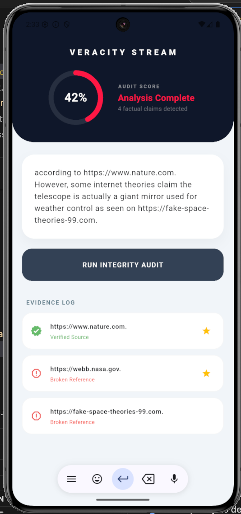
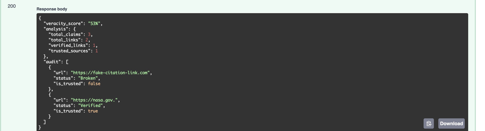

# 🔍 Project VeracityStream: Problem Statement

## 🚨 The Challenge (Problem Statement 3)
Generative AI models are widely used for research, learning, and decision-making. However, these models often generate **factually incorrect information** presented with high confidence.

A critical extension of this problem is the creation of **fake citations, non-existent references, and broken links**, which appear legitimate but cannot be verified. This makes it difficult for users to trust AI-generated content and may lead to:
* **Misinformation**
* **Legal Risks**
* **Ethical Concerns**

## 💡 The Solution
Build a system that can **detect, flag, and verify** factual claims and citations generated by AI models, helping users distinguish between reliable and unreliable AI-produced information.
---
## 👥 Team: NITP | 🔍 Project: VeracityStream

---

# 🔍 VeracityStream  
> **Byte Quest: PS 03** | *Fighting AI Hallucinations with Real-Time Verification*

[](https://flutter.dev)
[](https://www.python.org)
[](#)

---
# 💡 Deployed Link
> **[🔗 Access Project Drive (APK & Source)](https://drive.google.com/drive/folders/1c4LCgsUCGYf2QVPUdP9XZb0je2rBJB88?usp=sharing)**

| Resource | Description |
| :--- | :--- |
| 📱 **Android APK** | Pre-built binary for manual testing and UI evaluation. |
| 🎥 **Walkthrough** | A 2-minute demonstration of the full-stack verification flow. |
| 📂 **Source Archive** | Complete repository backup for offline review. |
| 📄 **Setup Guide** | Step-by-step instructions for local FastAPI & Flutter execution. |

---

## 🚩 The Challenge: AI’s “Confidence Gap”

Generative AI models are widely used for research, learning, and decision-making.  
However, they often generate **factually incorrect information with high confidence**, leading to trust, legal, and ethical risks.

**VeracityStream** is an automated verification layer designed to address:

- **Fabricated Facts** – Claims without empirical evidence  
- **Ghost Citations** – Fake, broken, or non-existent references  
- **Misinformation Risks** – Harm caused by unreliable AI-generated content  


## 🧠 System Overview

<p align="center">
  
</p>

---

## 📂 Project Structure
* `veracity_app/`: Flutter frontend.
* `veracity_backend/`: Python FastAPI engine & NLP logic.
---

## 📂 Project Structure (Frontend)

Implemented in **Commit 2**, the Flutter application follows a **feature-first architecture with MVVM-inspired separation**, ensuring scalability and clean state management.

```text
lib/
├── core/
│   ├── constants/       # App-wide strings and veracity labels
│   ├── theme/           # Material 3 theme with custom veracity colors
│   └── network/         # HTTP/Dio client configuration
├── features/
│   └── verification/    # Core feature: AI text analysis & UI
│       ├── models/      # Claim and source data models
│       ├── view/        # VeracityHighlighter and result widgets
│       └── viewmodel/   # API communication and verification state
└── main.dart            # App entry point and theme initialization
```

**Flow:**

1. User inputs AI-generated text or a URL  
2. Text is decomposed into individual factual claims  
3. Claims and citations are verified using academic and web sources  
4. Results are scored and visualized in a color-coded UI
---
## 🌐 System Architecture
The project follows a **Client-Server** architecture to ensure modularity and scalability:

1. **Frontend (Flutter)**: Captures user input and sends it via HTTP POST to the backend.
2. **Service Layer**: Handles JSON serialization and data modeling in Dart.
3. **Backend (FastAPI)**: Receives text, executes spaCy NLP decomposition, and pings citations.
4. **Scoring Engine**: Returns a weighted veracity score to the frontend.

---
## ⚙️ Technical Workflow
1. **Flutter Mobile**: Captures text and sends it to `10.0.2.2:8000/verify`.
2. **FastAPI Engine**: Uses **spaCy** to extract claims and **Regex** to find URLs.
3. **Audit System**: Pings URLs in parallel to check HTTP status.
4. **Scoring Logic**: Calculates a weighted score based on source authority (.gov, .edu).
---
### 📡 Internal API: `POST /verify`
The Flutter app interacts with this primary endpoint:
* **Request**: `{ "text": "AI generated string" }`
* **Response**: Includes `veracity_score`, `total_claims`, and a detailed `audit` list of URLs.
---
## ✨ Core Features (Beta)
* **NLP Claim Decomposition**: Breaks long-form AI responses into individual factual units using spaCy.
* **Real-time Link Auditing**: Uses `requests` to ping generated citations and identify "Ghost Citations" (404s).
* **Confidence Mapping**: Differentiates between verified sources and hallucinated references.
---
## 🧑‍💻 Some Screeshots
<figure align="center">
  
  <figcaption><b>Fig 1: The input interface for AI-generated text analysis.</b></figcaption>
</figure>

<br>

<figure align="center">
  
  <figcaption><b>Fig 2: Color-coded veracity results highlighting factual accuracy.</b></figcaption>
</figure>
<br>

<figure align="center">
  
  <figcaption><b>Fig 3: App Screenshot.</b></figcaption>
</figure>


## ⚖️ Veracity Scoring Logic

To eliminate AI hallucinations, **VeracityStream** calculates a truthfulness score ($V_s$) for every input using a weighted multi-factor analysis:

$$V_s = (L \times 0.50) + (A \times 0.30) + (C \times 0.20)$$

| Factor | Weight | Metric | Description |
| :--- | :---: | :---: | :--- |
| **Link Integrity ($L$)** | **50%** | `HTTP 200 OK` | Validates that citations are not "Ghost Links" (fabricated URLs). |
| **Source Authority ($A$)** | **30%** | `Domain Trust` | Assigns higher confidence to `.gov`, `.edu`, and peer-reviewed sources. |
| **Citation Coverage ($C$)** | **20%** | `Claim Ratio` | Measures the density of verified claims vs. total assertions. |

> **Note:** A score below **40%** triggers a 🔴 High Risk alert, while scores above **85%** are marked as 🟢 Verified.

<figure align="center">
  
  <figcaption><b>Fig 4: Example output of a score.</b></figcaption>
</figure>


---
## 🎯 Key Objectives & Impact

### ✅ Automated Claim Extraction
Breaks unstructured AI text into independent, testable factual units using NLP.

### 🔗 Citation Audit Engine
- Validates URLs in real time  
- Detects fake or broken references  
- Verifies metadata against academic databases  

### 🎨 Semantic Veracity Mapping
A Flutter-based UI that highlights:
- 🟢 Verified claims  
- 🟡 Uncertain claims  
- 🔴 False or unverifiable claims  

---

## 🛠️ Tech Stack

### Frontend
- Flutter (Mobile & Web)

### Backend
- Python 3.10+
- FastAPI
- LangGraph

### Verification APIs
- OpenAlex (Academic search)
- Crossref (Citation metadata)
- SerpAPI (Web verification)

---
## ⚙️ Setup & Installation

### Backend (Python/FastAPI)
1. Navigate to the backend directory: `cd veracity_backend`
2. Create a virtual environment: `python3 -m venv venv`
3. Activate the environment: `source venv/bin/activate`
4. Install dependencies: `pip install -r requirements.txt`
5. Run the server: `python main.py`

### Frontend (Flutter)
1. Navigate to the app directory: `cd veracity_app`
2. Get packages: `flutter pub get`
3. **Important**: Ensure `api_service.dart` is set to `10.0.2.2` for Android Emulators.
4. Run the app: `flutter run`
---

## 📊 Success Metrics

- **Detection Accuracy:**  
  > 90% identification of fabricated citations and invalid references

- **Verification Latency:**  
  Under 3 seconds per factual claim

- **Source Reliability:**  
  Preference for peer-reviewed and authoritative sources

---

## 🚀 Build Milestones

- [x] Commit 1: Initial Vision & Strategic Roadmap  
- [x] Commit 2: Flutter Project Scaffolding & Theme  
- [x] Commit 3: Backend – NLP Claim Extraction  
- [x] Commit 4: Citation Metadata Validator  
- [x] Commit 5: Real-Time Verification & Scoring API  
- [x] Commit 6: Flutter ↔ Backend API Integration  
- [x] Commit 7: Flutter Veracity Highlight UI  
- [x] Commit 8: Final Polish & Documentation  

---

## 📌 Vision

> *“Trust is the missing layer in AI outputs. VeracityStream makes truth visible.”*
